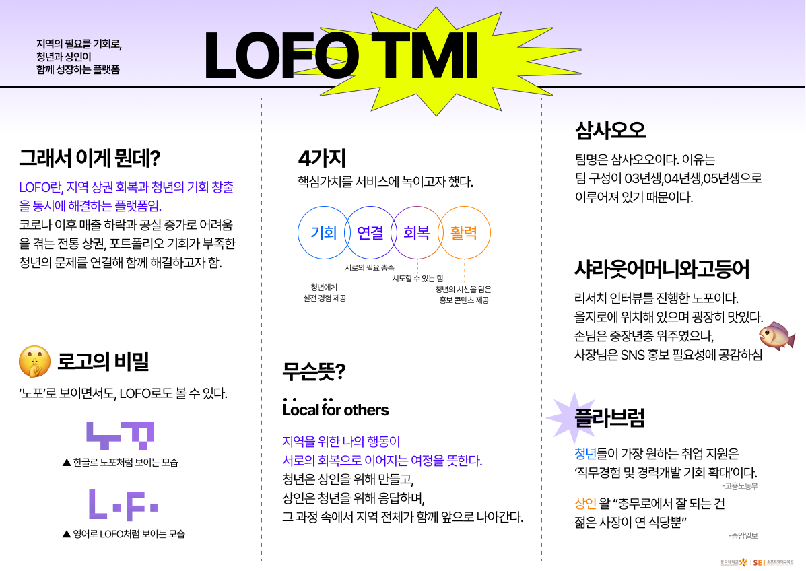
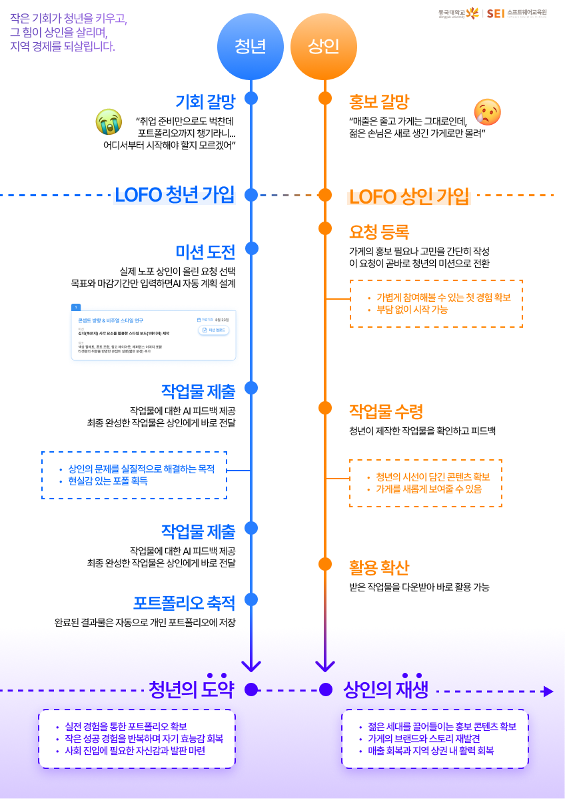

# 2025-hackathon-3-LOFO-backend

  

# 🌐 LOFO

> **청년의 성장은 포트폴리오로, 노포의 활력은 브랜딩으로**

---

## 📌 About LOFO

  
  &nbsp;&nbsp;
  

노포는 **홍보 역량 부족**으로, 청년은 **기회 부족**으로 어려움을 겪고 있습니다.  
**LOFO**는 두 문제를 연결해, **AI 기반 미션과 피드백**을 통해
청년에게는 **"실전 경험과 성장 기회"**를, 상인분들께는 **"지속 가능한 홍보 자산"**을 제공합니다.

---

## ✨ 주요 기능

-   🏪 **가게 요청 등록**  
    상인이 자신의 가게 문제(홍보·브랜딩·마케팅)를 요청으로 작성

-   🎯 **청년 미션 매칭 & 수행**  
    청년이 관심 있는 가게 요청을 선택 → 🤖 **AI가 맞춤 플랜과 가이드라인 제공** → 미션 수행

-   📦 **콘텐츠 전달 & 피드백**  
    청년이 제작한 홍보 콘텐츠 전달 → 상인이 결과 확인 ✍️ 피드백 작성 → 🤖 **AI가 자동 분석·피드백 강화**

-   📂 **포트폴리오 & 성장 관리**  
    청년은 제작물과 피드백을 포트폴리오에 저장 → 📈 AI 기반 성장 지표 및 성과 관리

-   📢 **커뮤니티 확산 기능**  
    완성된 콘텐츠를 LOFO 공식 채널(SNS/플랫폼)에 업로드 → 🌍 확산 및 2차 홍보 효과

---

## 🚀 서비스 배포 링크

  <h2>
    <a href="https://2025-hackathon-3-lofo.netlify.app/" target="_blank">
      👉 바로 가기
    </a>
  </h2>

---

## 🧪 테스트 계정 안내

서비스 테스트 시 아래 계정을 사용하실 수 있습니다.

-   **청년 계정**  
    📱 전화번호: `010-1234-5678`

-   **상인 계정**  
    📱 전화번호: `010-1234-5678`

해당 번호로 로그인하시면 바로 테스트 가능합니다. ✅

---

## 👥 Team Members

|                                                             Avatar                                                              | Name       | Role                                                                                                                                   | GitHub                                         | Email                |
| :-----------------------------------------------------------------------------------------------------------------------------: | ---------- | -------------------------------------------------------------------------------------------------------------------------------------- | ---------------------------------------------- | -------------------- |
|      | **박진희** |                         | [@wlsgml120](https://github.com/wlsgml120)     | 2022111017@dgu.ac.kr |
|  | **이보연** |  | [@leeboyeon17](https://github.com/leeboyeon17) | 2023110695@dgu.ac.kr |
|  | **김홍연** |  | [@HongYounKim](https://github.com/HongYounKim) | lunakby@dgu.ac.kr    |
|                | **권수현** |   | [@lo2q](https://github.com/lo2q)               | 1029tngus@dgu.ac.kr  |
|            | **구은지** |   | [@eunji9](https://github.com/eunji9)           | silverji9@dgu.ac.kr  |

---

## 🧰 Tech Stack

### Backend

   

### Frontend

   

### 배포

   

### 협업

    

### 개발 도구

